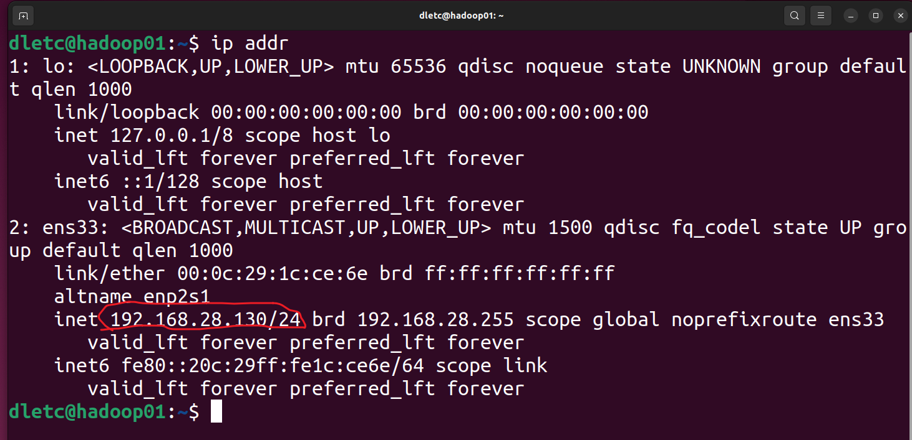
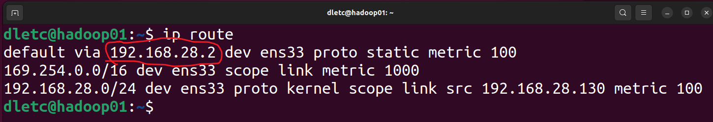
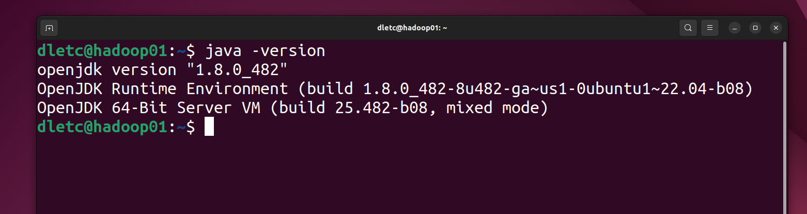
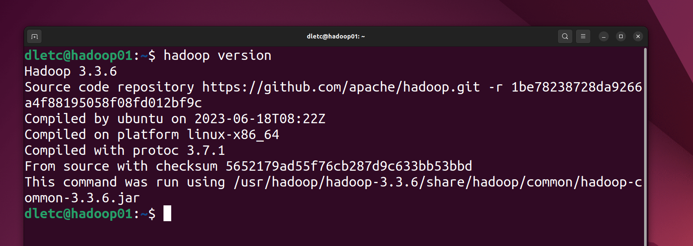

# 1.安装ubuntu的安装与配置


## 1.安装过程

省略


## 2.配置网络

**1.查看当前分配的ip**

```bash
ip addr
```




**2.查看网络的网关**

```bash
ip route
```




**3.配置网络**

修改`/etc/netplan/01-network-manager-all.yaml`

目的是使得该虚拟机拥有一个静态ip，方便后续连接访问

```yaml
# Let NetworkManager manage all devices on this system
network:
  version: 2
  renderer: NetworkManager
  ethernets:
    ens33:                 
      dhcp4: false      #禁止动态ip的分配   
      addresses:
        - 192.168.28.130/24 #对应查到的ip
      routes:
        - to: default
          via: 192.168.28.2 #对应查到的网关 
      nameservers:
        addresses:          #常用的DNS
          - 192.168.28.2
          - 8.8.8.8
          - 1.1.1.1
```


然后使用下面的命令使得刚才配置的文件生效

```bash
sudo netplan apply
```


## 3.安装配置ssh

```bash
sudo apt update
sudo apt install openssh-server
```


启动并设置开机自启

```bash
sudo systemctl start ssh   # 启动服务
sudo systemctl enable ssh  # 设置开机自动启动


sudo systemctl status ssh  #确认状态
```


关闭防火墙

```bash
sudo ufw disable #关闭防火墙

sudo ufw status #查看状态
```


## 4.尝试使用xshell与xftp进行连接

省略


## 5.复制多台虚拟机

这里以三台为例(也就是再复制2个)


**这里要注意的就是，一定要在克隆时，选择完全克隆（与被克隆再无瓜葛）**


## 6.配置其他虚拟机


### 1.配置网络

```txt
 - 192.168.28.130/24 #对应查到的ip
 只需要修改这个查到的ip
 比如第一台是192.168.28.130/24
 那么第二胎就可以是192.168.28.131/24 以此类推
```


### 2.修改主机名称

我们把第一个电脑称为hadoop01以此类推02，03

查看当前主机名称

```bash
hostname #查看当前主机名称
```


这里是已经修改过的


修改命令

```bash
sudo hostnamectl set-hostname hadoop01
```


### 3.配置主机与ip映射

修改`/etc/hosts`

所有电脑都要配置

```txt
dletc@hadoop01:~$ cat /etc/hosts
127.0.0.1	localhost
127.0.1.1	dletc

# The following lines are desirable for IPv6 capable hosts
::1     ip6-localhost ip6-loopback
fe00::0 ip6-localnet
ff00::0 ip6-mcastprefix
ff02::1 ip6-allnodes
ff02::2 ip6-allrouters

#对应ip与主机名
192.168.28.130 hadoop01 
192.168.28.131 hadoop02
192.168.28.132 hadoop03
```


验证是否修改成功

在hadoop01上尝试

```bash
ping hadoop02
ping hadoop03
```

ping通即成功


### 4.配置ssh免密登录


这里以在hadoop01上为例，其他的以此类推

生成密钥

```bash
ssh-keygen -t ed25519 -b 4096 -f ~/.ssh/id_ed25519 -N ""
```

`-t 指定加密算法`

`-b 指定密钥长度`

`-f 指定储存路径以及文件名`

`-N 指定密码，由于要免密登录，所以这里不设置`


将公钥拷贝到远程服务器

```bash
#ssh-copy-id 用户名@服务器IP
ssh-copy-id hadoop01 #自己也要进行拷贝
ssh-copy-id hadoop02
ssh-copy-id hadoop03
```


检查方法

```bash
ssh hadoop02
#ssh hadoop03
```

看是否是不需要密码直接可以登录


### 5.安装jdk

**这里请注意jdk版本与hadoop版本一定要兼容（这里选择的是jdk8,以及hadoop3.3.6）**


有梯子的情况下，可以直接使用命令安装

```bash
sudo apt update
sudo apt install openjdk-8-jdk -y
```


没有梯子的情况下…………….


安装好之后，需要配置jdk的环境变量

配置`/etc/profile`

在最后面添加

```bash
export JAVA_HOME=/usr/lib/jvm/java-8-openjdk-amd64 #这里需要改成你安装的java的目录
export JRE_HOME=${JAVA_HOME}/jre
export CLASSPATH=.:${JAVA_HOME}/lib:${JRE_HOME}/lib
export PATH=${JAVA_HOME}/bin:$PATH
```


保存退出后使用

```bash
source /etc/profile
```

source一下环境变量


验证是否成功

```bash
java -version
```




### 6.安装hadoop

创建目录`/usr/hadoop`

在网上下载好的安装包通过xftp传输到`/usr/hadoop`，并在该目录下进行解压。


配置环境变量

在`/etc/profile`文件中

```bash
export HADOOP_HOME=/usr/hadoop/hadoop-3.3.6
export PATH=$PATH:$HADOOP_HOME/bin:$HADOOP_HOME/sbin
```


配置好后，source一下环境

```bash
source /etc/profile
```


验证是否成功

```bash
hadoop version
```




### 7.配置hadoop集群

以下步骤三台电脑的操作完全一样，不需要更改配置文件中的内容


#### 1.配置hadoop-env.sh

打开`/usr/hadoop/hadoop-3.3.6/etc/hadoop/hadoop-env.sh`文件


把对应行注释取消，并在后面加上你电脑中java的位置


#### 2.配置core-site.xml

**定义了 HDFS 的入口和本地数据存放路径**


打开`/usr/hadoop/hadoop-3.3.6/etc/hadoop/core-site.xml`文件

```xml
<configuration>
		<property>
        	<name>fs.defaultFS</name>  #集群的“统一入口
        	<value>hdfs://hadoop01:8020</value>
    	</property>

    	<property>
        	<name>hadoop.tmp.dir</name> #Hadoop 运行过程中的临时数据存放目录
        	<value>/usr/hadoop/hadoop-3.3.6/data</value>
    	</property>
    
        <property>
        	<name>hadoop.http.staticuser.user.name</name> #Web 端“权限通行证”
       		<value>dletc</value> #这里要改成你的用户名
    	</property>
</configuration>

```


具体参数的解释

```xml
<property>
        	<name>fs.defaultFS</name>  #集群的“统一入口
        	<value>hdfs://hadoop01:8020</value>
</property>

协议层 (hdfs://)：告诉客户端，我们要访问的不是本地磁盘（file://），也不是阿里云 (oss://)，而是 Hadoop 专用的分布式协议。

逻辑层 (hadoop01)：这是 NameNode（大脑）的所在地。所有的文件读写请求，第一步都要先访问这个地址，询问 NameNode“我的文件存在哪台机器上”。

端口层 (8020)：这是 NameNode 监听 RPC（远程过程调用）请求的内部端口。它就像是 NameNode 的“办公座机”，DataNode 汇报心跳、客户端请求元数据，都打这个电话
```


```xml
<property>
        	<name>hadoop.tmp.dir</name>
        	<value>/usr/hadoop/hadoop-3.3.6/data</value>
</property>

它是所有存储的“父目录”：虽然参数名带着 tmp（临时），但在实际生产中，它决定了 HDFS 数据的物理存放点。你后续在 hdfs-site.xml 里配置的 NameNode 元数据目录（dfs/name）和 DataNode 数据块目录（dfs/data），默认都是在这个路径下自动创建子文件夹的。

为什么要显式配置？ Hadoop 默认会将这个路径指向 Linux 的 /tmp 目录。然而，Linux 系统在重启时会自动清理 /tmp。如果不改这个配置，一旦你的电脑关机重启，Hadoop 辛苦建立的元数据和存储的数据块就会被系统“一扫而空”，导致集群彻底崩溃。

底层联系：你之前执行 hdfs namenode -format 成功后，在这个 /usr/hadoop/hadoop-3.3.6/data 目录下就会生成一个 dfs/name/current 文件夹，里面存放的就是整个集群的“账本”（fsimage）
```


```xml
<property>
        	<name>hadoop.http.staticuser.user.name</name>
       		<value>dletc</value> #这里要改成你的用户名
</property>、


当你打开浏览器访问 9870 端口查看文件系统时，你并没有登录。默认情况下，Hadoop 会把你识别为一个“匿名用户”（通常是 dr.who），而匿名用户是没有权限删除或上传文件的。

通过这个配置，你告诉 Hadoop：“只要是从 Web 浏览器过来的请求，统统默认视为我的登录用户 dletc。”这样你以后在图形化界面里查看甚至操作文件时，就不会因为权限问题（Permission Denied）被拦在门外。
```


#### 3.配置hdfs-site.xml

`hdfs-site.xml` 专门负责定义**文件系统的存储规则**。它决定了数据如何被切分、如何被保护，以及我们如何通过可视化手段监控这些数据。	


打开`/usr/hadoop/hadoop-3.3.6/etc/hadoop/hdfs-site.xml`文件

```xml
<configuration>
	<property>
		<name>dfs.replication</name> #副本系数
        <value>3</value>
    </property>

    <property>
        <name>dfs.webhdfs.enabled</name> #是否开启 WebHDFS 功能。
        <value>true</value>
    </property>

    <property>
        <name>dfs.namenode.http-address</name> #NameNode 的 HTTP 服务地址
        <value>hadoop01:9870</value>
   	 </property>

    <property>
        <name>dfs.datanode.http.address</name> #DataNode（数据节点）的 Web 服务监听地址
        <value>0.0.0.0:9864</value> #这里的意思就是监听所有节点的9864端口
   	 </property>

    <property>
       	<name>dfs.namenode.secondary.http-address</name> #辅助名称节点（SecondaryNameNode）的通信地址
        <value>hadoop02:9868</value>
    </property>

</configuration>
```


详细参数解释

```xml
<property>
		<name>dfs.replication</name> #副本系数
        <value>3</value>
</property>


容错处理：在分布式系统中，单台机器掉线、硬盘损坏是常态。设置为 3 意味着 HDFS 会把每一个数据块（Block）在集群的不同机器上存 3 份。

副本放置策略：Hadoop 内部有一套巧妙的算法。默认情况下，它会将第一个副本存在客户端所在节点（如果你在 hadoop01 上传，01 就会存一份），第二个副本放在另一个机架的节点上，第三个副本放在与第二个副本同机架的不同节点上。

高可用性：即便你的 hadoop02 和 hadoop03 同时意外关机，只要 hadoop01 还亮着，你的数据依然是完整的。
```


```xml
<property>
        <name>dfs.namenode.http-address</name>
        <value>hadoop01:9870</value>
</property>

Web 控制台：这就是你在浏览器访问 http://192.168.28.130:9870 的底层支撑。它启动了一个轻量级的 Web 服务器。

读写分离：用户上传数据走的是 8020 端口（RPC 协议，极快）；而管理员查看集群健康状况、浏览文件目录走的是 9870 端口（HTTP 协议，易用）。

Hadoop 3.x 特性：在旧版（2.x）中这个端口是 50070，3.x 改为 9870 是为了避免与某些 Linux 临时端口冲突。

```


```xml
 <property>
       	<name>dfs.namenode.secondary.http-address</name>
        <value>hadoop02:9868</value>
</property>


解决性能瓶颈：NameNode（hadoop01）把所有元数据存在内存里，并把操作日志写在 edits 文件里。如果 edits 文件太大，NameNode 重启会极其缓慢。

定期合并（Checkpoint）：SecondaryNameNode（hadoop02）的作用是定期把主节点的 edits 日志下载过来，和旧的镜像文件（fsimage）合并成一个新的，再发回给主节点。

负载均衡：合并操作非常消耗 CPU 和内存。我们将它配在 hadoop02 而不是 hadoop01，就是为了防止“秘书”在干重活时抢占了“老板”的系统资源。

```


```xml
<property>
    <name>dfs.webhdfs.enabled</name>
    <value>true</value>
</property>


跨平台访问：如果没有它，你只能通过安装了 Hadoop 客户端的机器来操作文件。开启它后，任何支持 HTTP 的设备（甚至是你的手机）都可以通过标准的 RESTful API 来读取、下载或上传 HDFS 上的文件。

生态链对接：很多高级组件（如数据仓库 Hive、图形化界面 Hue）都是通过这个接口与底层 HDFS 通信的。它是 HDFS 从“封闭系统”走向“开放平台”的关键。
```


```xml
<property>
        <name>dfs.datanode.http.address</name>
        <value>0.0.0.0:9864</value>
</property>


监听所有节点的9864端口
```


#### 4.配置yarn-site.xml


打开`/usr/hadoop/hadoop-3.3.6/etc/hadoop/yarn-site.xml`文件

```
<configuration>

	<!-- Site specific YARN configuration properties -->
	<property>
        	<name>yarn.resourcemanager.hostname</name>
        	<value>hadoop01</value>
    	</property>

    	<property>
        	<name>yarn.resourcemanager.address</name>
        	<value>hadoop01:8032</value>
    	</property>

    	<property>
        	<name>yarn.nodemanager.aux-services</name>
        	<value>mapreduce_shuffle</value>
    	</property>

   	<property>
       		<name>yarn.nodemanager.vmem-check-enabled</name>
        	<value>false</value>
    	</property>

    	<property>
        	<name>yarn.nodemanager.env-whitelist</name>
        	<value>JAVA_HOME,HADOOP_COMMON_HOME,HADOOP_HDFS_HOME,HADOOP_CONF_DIR,CLASSPATH_PREPEND_DISTCACHE,HADOOP_YARN_HOME,HADOOP_MAPRED_HOME</value>
    	</property>

</configuration>
```


具体参数解释

```xml
<property>
    <name>yarn.resourcemanager.hostname</name>
    <value>hadoop01</value>
</property>
<property>
    <name>yarn.resourcemanager.address</name>
    <value>hadoop01:8032</value>
</property>

ResourceManager (RM) 是 YARN 的心脏。这两行配置告诉全集群所有的从节点（NodeManager）：“分配资源的权力在 hadoop01 手里”。

8032 端口：这是 RM 的 RPC 通信端口。从节点会定期通过这个端口向 RM 发送“心跳”，汇报自己还剩下多少内存和 CPU 核心。如果心跳断了，RM 就会认为该节点“挂了”，并将该节点上的任务转移到其他机器。
```


```xml
<property>
    <name>yarn.nodemanager.aux-services</name>
    <value>mapreduce_shuffle</value>
</property>

解耦设计：YARN 本身是一个通用的资源调度器，它并不懂 MapReduce 的逻辑。

Shuffle 机制：在 MapReduce 计算中，Map 阶段处理完的数据需要通过网络传输给 Reduce 阶段，这个过程叫 Shuffle（洗牌）。

作用：这个配置相当于在每个 NodeManager 身上安装了一个“插件”，允许 YARN 在底层协助处理 MapReduce 特有的数据洗牌请求。没有它，MapReduce 就无法在 YARN 上跑通。
```


```xml
<property>
        <name>yarn.nodemanager.vmem-check-enabled</name>
    <value>false</value>
</property>

背景：Java 虚拟机（JVM）在启动时，往往会向系统申请很大一块虚拟内存（Virtual Memory），但实际占用的物理内存（Physical Memory/RSS）可能很小。

矛盾：YARN 默认会严格检查虚拟内存。在很多 Linux 发行版中，虚拟内存的使用比例往往超过 YARN 的默认阈值。

为什么要关？ 如果不设为 false，你会发现你的 MapReduce 任务刚开始跑就被 YARN 强制杀掉（Kill），并报错 Container is running beyond virtual memory limits。关闭它能显著提高任务在开发环境中的稳定性。
```


```xml
<property>
    <name>yarn.nodemanager.env-whitelist</name>
    					 		      						<value>JAVA_HOME,HADOOP_COMMON_HOME,HADOOP_HDFS_HOME,HADOOP_CONF_DIR,CLASSPATH_PREPEND_DISTCACHE,HADOOP_YARN_HOME,HADOOP_MAPRED_HOME</value>
</property>


容器化思维：YARN 在运行任务时，会为每个任务创建一个隔离的 Container（容器）。为了安全，容器默认不继承宿主机的环境变量。

白名单作用：这行配置就像是一个“特许通行证”，它告诉 NodeManager：“当你在创建容器执行任务时，请务必把这些关键的环境变量（特别是 JAVA_HOME）传递进去”。

避坑点：这是 Hadoop 3.x 引入的重要安全特性。如果不配，你会发现任务报错说“找不到 Java”或“找不到类定义”，即便你已经在 /etc/profile 里配好了环境变量也没用
```


#### 5.配置mapred-site.xml


**计算框架 (`mapred-site`)**：明确了 MapReduce 任务必须在 YARN 平台上运行。


打开`/usr/hadoop/hadoop-3.3.6/etc/hadoop/mapred-site.xml`文件

```xml
<configuration>
	<property>
        	<name>mapreduce.framework.name</name> #确定“老板”是谁
        	<value>yarn</value>
    	</property>

    	<property>
        	<name>mapreduce.jobhistory.address</name>
        	<value>hadoop01:10020</value>
    	</property>

    	<property>
        	<name>mapreduce.jobhistory.webapp.address</name>
        	<value>hadoop01:19888</value>
    	</property>

    	<property>
        	<name>mapreduce.application.classpath</name>
        	<value>/usr/hadoop/hadoop-3.3.6/share/hadoop/mapreduce/*:/usr/hadoop/hadoop-3.3.6/share/hadoop/mapreduce/lib/*</value>
    	</property>

</configuration>
```


参数详细解释

```xml
<property>
    <name>mapreduce.framework.name</name>
    <value>yarn</value>
</property>

委派管理：这个配置明确告诉 MapReduce：“你现在只是一个‘干活的协议’，不要自己去抢内存和 CPU，所有的资源申请必须通过 YARN（ResourceManager）来完成。”

核心价值：它让 YARN 变成了通用的资源池，不仅能跑 MapReduce，以后你想跑 Spark 或 Flink 也可以共享同一套资源。
```


```xml
<property>
    <name>mapreduce.jobhistory.address</name>
    <value>hadoop01:10020</value>
</property>

数据留存：YARN 在任务结束后的瞬间会回收资源并清理掉任务运行的临时信息。

通信节点：这个配置指定了 hadoop01 上的一个后台进程，专门负责把那些已经跑完的任务详情（耗时多久、哪个 Map 失败了、处理了多少行数据）记录下来。

10020 端口：这是集群内部组件（如 YARN）向历史服务器传输数据时使用的 RPC 端口。
```


```xml
<property>
    <name>mapreduce.jobhistory.webapp.address</name>
    <value>hadoop01:19888</value>
</property>

	
可视化复盘：这是给人看的。当你昨天跑了一个任务报错了，今天想查原因，你就可以在浏览器输入 hadoop01:19888 看到完整的日志记录。

性能调优：通过这个界面，你可以观察每个 Map 和 Reduce 任务的耗时分布，这是判断集群是否存在“数据倾斜”或“节点性能不均”的核心手段。
```


```xml
<property>
    <name>mapreduce.application.classpath</name>
    <value>/usr/hadoop/hadoop-3.3.6/share/hadoop/mapreduce/*:/usr/hadoop/hadoop-3.3.6/share/hadoop/mapreduce/lib/*</value>
</property>

解决“找不到类”报错：这是 Hadoop 3.x 搭建时最硬核的避坑点。当 YARN 启动一个容器（Container）来跑 Map 任务时，它需要加载 MapReduce 运行所需的各种 .jar 包（比如排序算法、数据切片算法等）。

显式指定：虽然你配了全局环境变量，但 MapReduce 的容器是高度隔离的。通过在这里显式指定这些 share/hadoop/mapreduce/ 下的路径，保证了任务运行时能精准地找到它的“工具箱”，避免报出 java.lang.ClassNotFoundException
```


#### 6.配置workers

`workers` 文件（在 Hadoop 2.x 时代被称为 `slaves`）的逻辑非常纯粹：它是集群的**“员工花名册”**，也是实现**“一键群控”**的底层依据。

虽然它只是一个简单的文本文件，但它在 Hadoop 的自动化运维中扮演了至关重要的角色。


打开`/usr/hadoop/hadoop-3.3.6/etc/hadoop/workers`文件


把原内容删除，并把对应节点放进去

```xml
hadoop01
hadoop02
hadoop03
```


# 2.启动集群

**这些操作仅在hadoop01(主节点)中进行**


## 1.格式化HDFS

```bash
hdfs namenode -format
```


## 2.启动hadoop集群

不建议使用start-all命令暴力启动

```bash
start-dfs.sh
start-yarn.sh
```


## 3.关闭hadoop集群

不建议使用stop-all命令暴力停止

```bash
stop-yarn.sh
stop-dfs.sh
```


# 常见问题

## 1.网络相关问题


**解决右上角网络图标消失**

```bash
sudo service NetworkManager stop
sudo rm /var/lib/NetworkManager/NetworkManager.state
sudo service NetworkManager start
```


## 2.ssh免密失败


### 1.权限问题

如果执行了 `ssh-copy-id` 仍然需要密码，90% 的情况是由于服务器端的**目录权限过大**（SSH 安全策略规定：如果权限太开，密钥就可能被他人篡改，因此会失效）。

```bash
# 2. 确保 .ssh 目录权限为 700 (drwx------)
chmod 700 ~/.ssh

# 3. 确保 authorized_keys 文件权限为 600 (-rw-------)
chmod 600 ~/.ssh/authorized_keys
```

