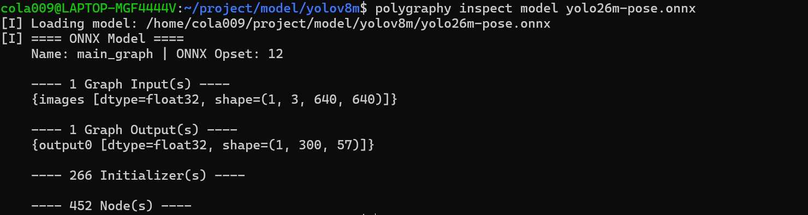
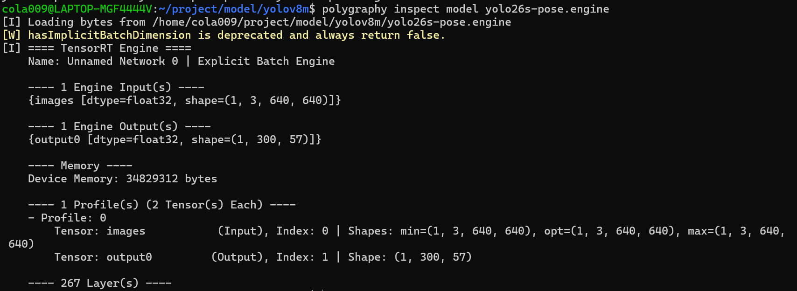

# 1.部署

## 1.模型格式

**TensorRT从框架导入训练模型的主要方式是[ONNX](https://onnx.ai/)交换格式。TensorRT 自带一个 ONNX 解析器库，以辅助导入模型**


## 2.代码


**导入代码**

```c++
#include “NvInfer.h”#构建网络使用
#include “NvOnnxParser.h"#使用 ONNX 解析器导入模型

using namespace nvonnxparser;
using namespace nvinfer1;
```


**创建ONNX解析器**

```c++
IParser* parser = createParser(*network, logger);

#检查模型文件
parser->parseFromFile(modelFile,
    static_cast<int32_t>(ILogger::Severity::kWARNING));
for (int32_t i = 0; i < parser->getNbErrors(); ++i)
{
std::cout << parser->getError(i)->desc() << std::endl;
}
```


# 3.特点

## 1.TensorRT 的输入输出与显存绑定机制 (Binding)


## 2.量子化

TensorRT支持量化浮点，浮点数通过线性压缩和四舍五入为低精度量化类型（INT8、FP8、INT4、FP4）。这显著提高了算术吞吐量，同时减少了存储需求和内存带宽。在量化浮点张量时，**TensorRT必须了解其动态范围——即重要的值范围**——量化时会限制超出该范围的值。


# 4.工具

## 1.Netron 

可以用来查看**ONNX** 模型的输入输出结构，


## 2.polygraphy

可以用来查看**ONNX** 模型的输入输出结构，NVIDIA 官方的神器利器可以在linux的命令行中直接运行


```c++
polygraphy inspect model yolo26m-pose.onnx
```




```c++
polygraphy inspect model yolo26s-pose.engine
```




# 先放着的内容

## 1.MIG

**多实例GPU，特性允许GPU（从NVIDIA Ampere架构开始）被安全地分割为 CUDA 应用最多可运行七个独立的 GPU 实例**